# 「词元新学」—— 由 Token 驱动的大学生自主学习智能体平台
# 项目计划书

> 赛道：中国国际大学生创新大赛（原"互联网+"）
> 「词元新学」——致力于打造一种由 Token 驱动的新型自主学习平台
> 配图：11 张界面截图已嵌入正文全部为真实运行画面与真实数据
> 数据截止：2026-09-12，全部为实测/官方数据、可溯源。产品工程已完整实现并部署上线：官网与 Windows 桌面客户端均已开放，在线体验入口见「一、执行摘要 · 当前里程碑」

---

## 一、执行摘要

AI 已经能回答大学生的一切提问，却没有一个产品负责"让学生真的学会"。通用 AI 助手问答即止：读过的资料不沉淀、理解的漏洞没人管、遗忘没有任何机制对抗。**学习的执行环节，是 AI 时代教育产品最大的空档。**

「词元新学」用一个由 Token 驱动的自主学习智能体填上这个空档：学生表达意图，平台把意图拆解为 AI 可自主执行的任务流——检索、阅读、比对、总结、出题、批改、安排复习——每一步的算力消耗即 Token，预算透明可控。学习成果沉淀为本机知识资产，并通过 Leitner 五盒遗忘曲线调度"到期回炉"，形成完整闭环：**读 → 存 → 考 → 复习**。

平台通过"目标轨道"机制适配考研、考公、求职等多场景（新场景一份配置文件即可扩展）。产品已完成完整工程实现（约 2.7 万行 Python、9 千行前端、近千个自动化测试用例），核心场景通过真实数据验证。我们的差异化不是"又一个 AI 问答助手"，而是**第一个把学习做成完整闭环、且数据全程不出本机的自主学习平台**。

**项目愿景**：让每一位普通大学生都拥有数据不出本机的"私人学习研究员"——AI 负责一切执行性劳动，学生回归理解、决策与创造。商业上，我们以"免费闭环获客 + TokenPlan 订阅 + B 端授权变现"的组合模式切入 4700 万在校生市场，响应国家教育数字化战略，做 AI 时代大学生学习的默认基础设施。

**当前里程碑**：工程侧已完成（2.7 万行后端 + 9.3 千行前端 + 976 个自动化测试），核心场景经真实数据验证（一次四校调研 190 秒、64 个可溯源来源）；**产品官网已上线（https://ciyuan.yongchutafei.asia），Windows 桌面客户端开放下载，全链路可在本机实际跑通——本计划书所述功能均为已实装状态**；内测包已定向发放，学习成效对照实验与软著申请在推进中。

---

## 二、风口与政策：天时地利

### 2.1 我们抓到的三个风口

1. **生成式 AI 用户爆发**：我国生成式 AI 用户规模已超 5 亿，大学生是渗透率最高、付费意愿最强的群体之一——AI 学习工具的用户教育已经完成，市场只缺"懂学习的产品"；
2. **Agent 元年**：2025 年被业界广泛视为"AI Agent 元年"，智能体从对话走向自主执行任务。本项目的 agentic 架构（模型自主编排、Token 预算调度）正是这一代技术的产品化落地，踩在技术范式切换的节点上；
3. **AI+教育赛道升温**：大模型能力跨越"可讲解、可出题、可批改"的可用性阈值，教育数字化预算持续投入，校内场景从"禁 AI"转向"用 AI"——供给侧刚刚打开。

### 2.2 响应的政策导向

| 政策 | 与本项目的契合点 |
|---|---|
| 《教育强国建设规划纲要（2024—2035 年）》提出实施教育数字化战略、促进人工智能助力教育变革 | 本项目即"AI 助力学习"的落地产品，可成为高校数字化转型的学生侧抓手 |
| 政府工作报告连续两年部署"人工智能+"行动 | "AI + 学习"是"人工智能+"在教育领域最直接的落地场景 |
| 教育部持续推进教育数字化、推动高校人工智能通识教育与智能工具进校园 | 产品定位与高校"智能工具进校园"方向一致，B 端部署有政策抓手 |
| 《生成式人工智能服务管理暂行办法》等数据安全监管趋严 | 本地优先架构天然满足"数据最小化"要求，合规成本极低 |

### 2.3 时代断层：AI 时代的"学习方式断层"

- 全国在校大学生约 **4700 万人**，几乎人人都在用 AI 辅助学习——但用法停留在"搜一搜、问一问、抄一抄"；
- 认知科学的基本事实没有变：**不测试就会遗忘**（艾宾浩斯：20 分钟后遗忘 42%），"读过了"和"会做了"之间没有任何机制负责；
- 通用 AI 助手的产品形态与学习方法论严重脱节：对话即终点，无沉淀、无检验、无复习——学生用 AI 越方便，"虚假掌握"越普遍。

**断层即机会：把学习科学（测试效应、间隔重复）装进智能体，让 AI 负责"学会"而不是"回答"。**

### 2.4 真实痛点切片：一次择校调研的人力成本（项目起点）

本项目的第一块试金石是考研择校——自主学习需求最刚性、信息最不对称的场景。开发者本人考研择校时，为比对四校计算机专硕信息编写了 23 个一次性抓取脚本（1384 行代码）、产生 242 个中间文件。原因在于信息源的三个特征：

1. **异步加载**：多数院校专业目录是三层嵌套的树形 JSON，复制粘贴无效；
2. **编码陷阱**：官方 PDF 中科目代码为私有编码（如"鈶?01"实为"①101 思想政治理论"），复制即乱码；
3. **同码不同卷**：同一专业代码挂在不同学院、考试科目不同——选错目标可能白复习半年。

**这不该是每个学生重复支付的代价。它应当被一个智能体一次性解决。**

### 2.5 学习侧痛点：资料在库，掌握不在脑

学生用任何工具读完资料后：
- 聊天记录无法沉淀为结构化知识资产；
- 没有任何机制对抗遗忘；
- "读过了"和"会做了"之间没有人负责——通用 AI 助手尤其如此。

---

## 三、产品方案：由 Token 驱动的完整学习闭环

### 3.1 先看懂学生：用户画像驱动的个性化

平台启动的第一步是构建用户画像——年级、专业、目标与真实困难。它不是一次性的欢迎弹窗，而是贯穿全产品的校准源：AI 的调研视角、开场建议、练习难度、术语深度都由此决定。

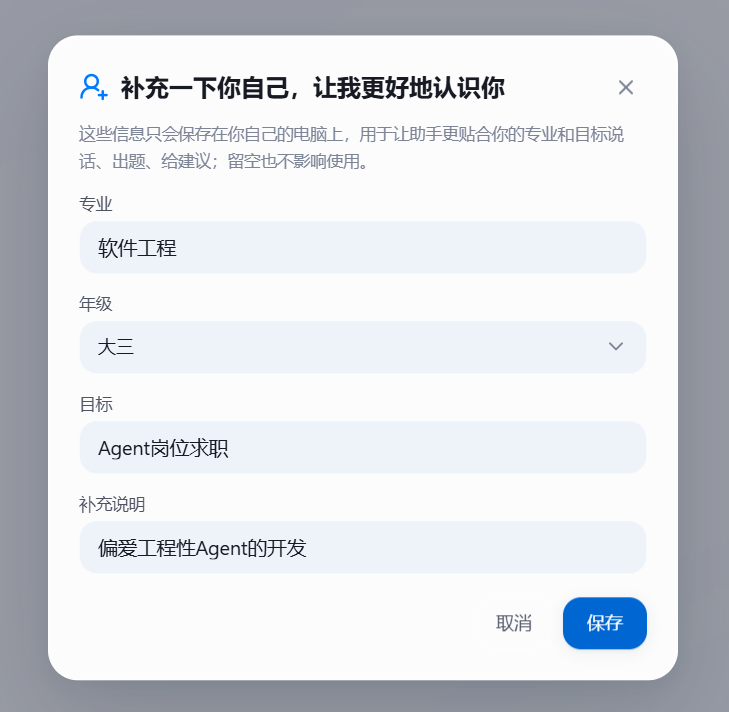

*图3-1：用户画像——年级、专业、目标与补充说明，全部保存在本机*

画像一旦建立，差异立刻可见：空会话的开场建议会围绕该学生的目标与专业生成，而不是通用模板。

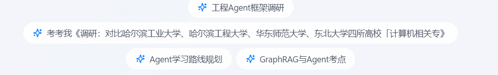

*图3-2：画像建立后，开场建议围绕该学生的目标生成（图中为「Agent 岗位求职」画像驱动的建议）*

### 3.2 学习闭环

产品为 Windows 桌面应用（本地优先），以 Token 为调度单位组织六大环节构成闭环：

```
学生意图（"我要学会 X"）
        │ Token 预算分配
        ▼
① 文档精读 ──► ② 深度调研 ──► ③ 资料沉淀
      ▲                              │
      │                              ▼
⑥ 间隔复习 ◄── ⑤ 智能判分 ◄── ④ 练习出题
（Leitner 五盒算法，到期自动回炉）
```

每个环节都是 AI 自主执行的任务流：Token 是它的燃料与计量单位——哪一步花多少预算、何时收尾交付，全部透明可审计（调研过程中实时展示每一次思考、检索与来源）。

**① 文档精读**：系统集成到右键菜单——任意文件"Learn with Assistant"，无需打开应用即可开始学习；浏览器扩展支持网页资料一键剪藏入库。

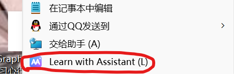

*图3-3：系统集成——任意文件右键「Learn with Assistant」即可交给助手（真实右键菜单）*

右键该文件交给助手处理后，可以得到如下——AI 给出四个去向，恰好对应闭环的其余环节：深入讲解、出题检验、对比调研、整理入库。

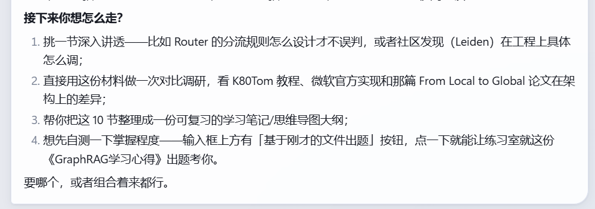

*图3-4：精读完成后的四个去向——深入讲解、对比调研、整理笔记、自测出题，闭环由此咬合（真实对话记录）*

**② 深度调研**：AI 自主规划检索路径，多源交叉核验，每条结论附来源链接；数据冲突显式标红并列来源，禁止静默取舍；查不到写"未获取到"，严禁编造。

**③ 资料沉淀**：调研报告、精读笔记统一入学习库（Markdown + 向量知识库），随时检索问答；每份笔记可重问、编辑、一键导出 Word。

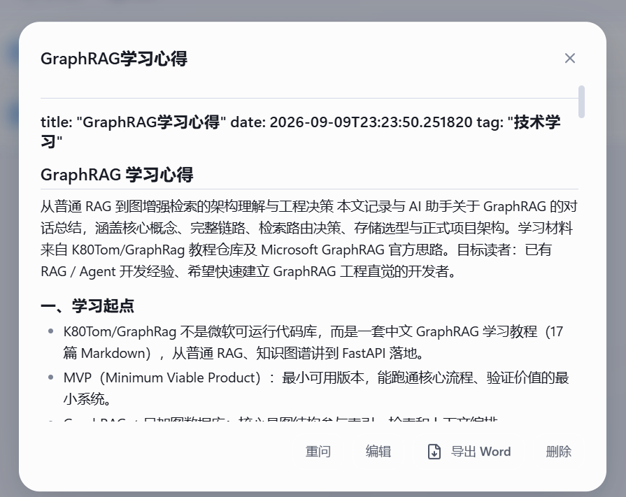

*图3-5：资料库中的结构化笔记——《GraphRAG 学习心得》，底部可重问、编辑、导出 Word（真实笔记）*

**④⑤ 出题与判分**：基于任意已入库材料自动生成练习题，客观题自动判分、主观题 AI 评阅并给改进建议。

**⑥ 间隔复习**：错题与知识点进入 Leitner 五盒调度，按掌握程度动态安排复习间隔，到期自动推回——这是与所有"问答即止"型产品的本质区别。

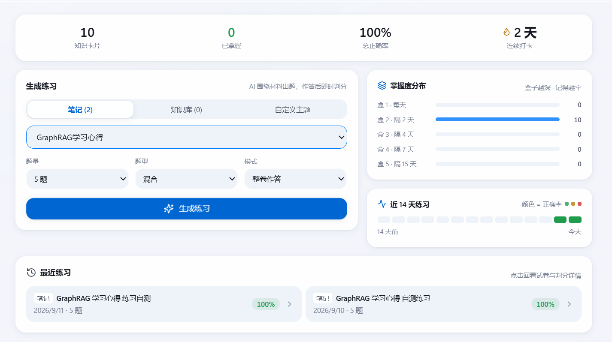

*图3-6：练习室——就刚入库的《GraphRAG 学习心得》出题，五盒掌握度分布、连续打卡与正确率（真实使用记录）*

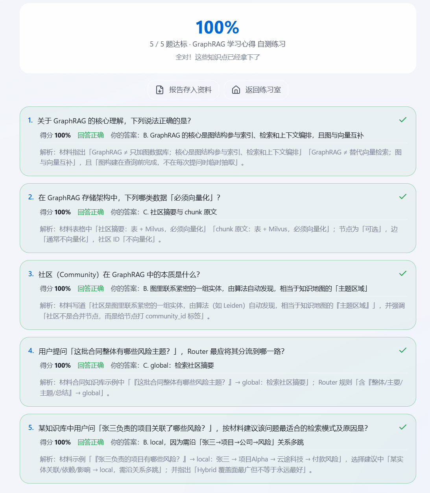

*图3-7：练习判分详情——得分、逐题解析、正确答案即时反馈（真实练习记录）*

至此，从右键一份文件开始：精读 → 选择去向 → 沉淀成笔记 → 就笔记出题 → 判分回炉——一份材料走完整个闭环，全程无需用户操心流程编排。

**目标轨道 = 平台化扩展机制**：学生建立"考研 / 考公 / 求职"目标轨道后，AI 的调研模板、开场建议、关键时间节点（如"预报名还有 13 天"主动提醒）随之校准——但轨道只是**一份配置文件**（场景提示 + 输出字段 + 时间节点），不是代码分支：加"留学"轨道零代码，这就是"平台"与"套壳"的区别。

目标轨道之下的一次真实考研调研，完整记录如下——先看报告与依据：

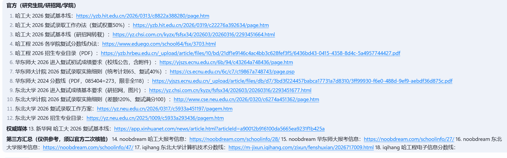

*图3-8：深度调研的报告依据——18 条来源按"官方 → 权威媒体 → 第三方汇总"分级标注，全部可点击核验（真实四校调研）*

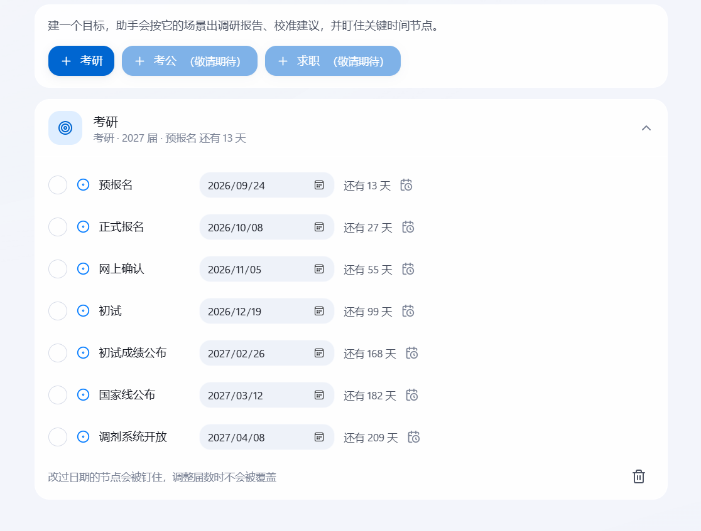

*图3-9：目标轨道——建立考研轨道后自动排布 7 个关键节点并倒计时；考公、求职轨道同机制扩展*

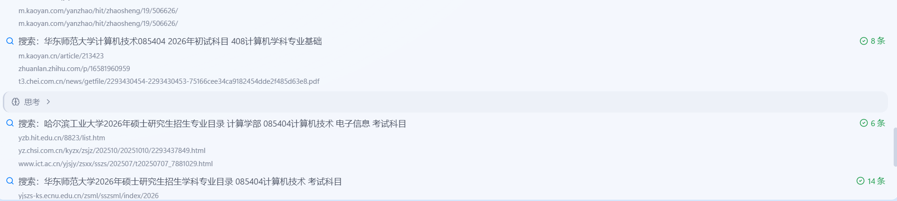

*图3-10：主会话执行实录——AI 先"思考"拆解任务，再多路并行检索，每一路显示命中数与来源（真实四校调研记录）*

---

## 四、技术方案与壁垒

### 4.1 架构：Agentic by Design

- **模型主导编排**：不写死流程分支，由模型自主决定工具调用；框架负责安全执行、预算控制与降级。
- **四类子智能体**：调研（researcher）/ 探索（explorer）/ 操作（operator）/ 整理（organizer），各自持有独立的工具集、预算与取消令牌，支持并行执行、暂停续跑与断点恢复。

### 4.2 为"烂数据"而生的通用解析管线（核心壁垒）

互联网上真正有价值的学习与决策数据，大多"反自动化"：异步树形目录、私有编码 PDF、同码不同义。本项目沉淀出一套**与领域无关的通用解析管线**——数据源只需一份配置描述（入口 URL、结构类型、编码特征、校验规则）即可接入；研招数据是迄今遇到最难的一例，因此以它作为能力验证的极端样本。

| 能力（通用） | 实现 | 实测结果（研招样例） |
|---|---|---|
| PDF 表格抽取 | 文本层 → 表格检测 → 扫描件 OCR 三级降级 | 从哈工大深圳目录抽出"0854 电子信息（计算机技术）132 人" |
| 异步目录/乱码 | 编码修复 + 树形结构展开 | 华东师大分数线表完整还原（院系/学科/线/统考计划） |
| 搜索质量闸门 | 查询-结果相关度打分，零相关判失败 | 杜绝"搜招生目录返回旅游攻略"类垃圾（真实事故） |
| 显式失败 | 搜索/解析失败如实报错，不静默换源 | 用户永远知道哪些数据可信、哪些缺失 |

**一次真实调研的完整指标**（四校计算机专硕对比）：18 轮自主执行、39 次检索（39 个唯一查询，零重复）、27 次页面/文档解析、仅 3 次失败且均为预期行为，全程 190 秒，产出 10 列对比表 + 64 个可点击来源链接。

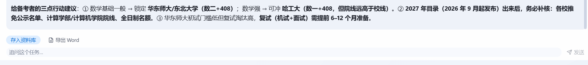

*图4-1：调研成果一键「存入资料库 / 导出 Word」，上方为 AI 生成的三点行动建议*

### 4.3 生产级韧性设计

- 主机熔断（同一站点连续失败自动拉黑换源）、LLM 超时原地重试、失败原因回灌给模型、工具结果三层工件（L0 原文/L1 轨迹/L2 发现）+ 上下文自动压缩——保证长任务不烧穿预算也能交付"诚实的不完整报告"。

### 4.4 本地优先 + 安全围栏

- 学习资料、知识库、对话数据全部存本机（SQLite + 本地向量库）；
- SSRF 防护（拦截内网地址）、文件操作围栏、危险命令确认；
- 唯一的外部依赖是模型 API（可配置多家），**不依赖单一模型供应商——模型是可替换的，沉淀在本地的知识资产不是**。

### 4.5 工程完成度

| 指标 | 数值 |
|---|---|
| 后端 Python | ~27,300 行 |
| 前端 React/TS | ~9,300 行 |
| 自动化测试用例 | 976+（全绿） |
| 主智能体可用工具 | 38 项 |
| 已交付功能模块 | 14 个（agent/daemon/export/goals/knowledge/memory/practice/research/subagents/tools/ui/voice…） |

---

## 五、创新点

1. **闭环创新**：业内首个把"出题—判分—按遗忘曲线回炉"做进产品的自主学习智能体平台，将通用 AI 的"读过"变成可度量的"记住"。
2. **"Token 驱动"的调度创新**：以 Token 预算为任务调度的第一公民——深度调研按难度分档分配轮次预算、上下文自动压缩防膨胀、预算收尾机制保证"诚实的不完整交付"，让长任务在算力约束下可靠完成；预算对用户透明可视。
3. **数据创新**：针对"反自动化"的真实数据源（异步树形目录、私有编码 PDF）构建三级解析管线，把人力数天的信息搜集压缩到分钟级，且每格数据可溯源。
4. **平台化创新**：目标轨道以配置而非代码扩展场景——考研/考公/求职已是内置轨道，新场景（留学、资格证）零代码接入。

---

## 六、竞品分析：与市面 AI 工具的全面对比

### 6.1 能力维度对比

| 维度 | DeepSeek / Kimi / 豆包 | ChatGPT | NotebookLM | 夸克/秘塔 AI 搜索 | Anki 等记忆工具 | 考研信息平台 | **词元新学** |
|---|---|---|---|---|---|---|---|
| 定位 | 通用 AI 问答 | 通用 AI 问答 | 文档问答摘要 | AI 搜索 | 间隔记忆 | 信息发布/社区 | **学习闭环智能体** |
| 深度调研+来源溯源 | 部分 | 部分 | 弱 | 强（搜索向） | ✗ | 无 | **✓ 多源交叉核验+分级标注** |
| 结构化解析（PDF目录/异步树） | ✗ | 部分 | ✗ | ✗ | ✗ | 人工维护 | **✓ 实测通过** |
| 知识沉淀 | 聊天记录 | 聊天记录 | 笔记本 | 历史记录 | 卡片库 | 无 | **✓ 学习库+向量检索** |
| 基于自有材料出题/判分 | ✗ | ✗ | ✗ | ✗ | 手动制卡 | 静态题库 | **✓ 自动出题+AI 批改** |
| 间隔复习调度 | ✗ | ✗ | ✗ | ✗ | **✓（需手动维护）** | ✗ | **✓ Leitner 五盒自动化** |
| 用户画像个性化 | 轻度 | 轻度 | ✗ | ✗ | ✗ | ✗ | **✓ 年级/专业/目标/轨道** |
| 数据隐私 | 云端 | 云端 | 云端 | 云端 | 本地（但无智能） | 云端 | **✓ 本地优先** |

### 6.2 逐家对比：我们与它们的本质不同

- **vs DeepSeek / Kimi / 豆包（通用对话助手）**：它们是"更聪明的嘴"，我们是"会干活的学习研究员"。它们回答完就结束；我们回答完开始执行——存库、出题、安排复习。用户不需要会写 Prompt，表达意图即可。
- **vs ChatGPT（全球标杆）**：能力最强但云端闭源、数据出境，高校场景合规成本高；且同样止于对话。我们的本地优先架构在校园市场是**合规性差异化**，而非单纯的功能差异。
- **vs NotebookLM（谷歌文档问答）**：同样"读文档"，但它止步于摘要与问答；我们把读过的东西变成题目、变成复习计划、变成可导出的决策报告。
- **vs 夸克/秘塔（AI 搜索）**：搜索层强，但结果"看完即走"——没有沉淀、没有检验。我们的调研结果是结构化知识资产，直接进入学习和出题流程。
- **vs Anki（记忆软件标杆）**：Anki 证明了间隔重复的有效性，但制卡成本极高、多数学生坚持不下来——我们把"制卡、判分、调度"全部自动化，**Anki 验证了需求，我们解决了坚持不下去的原因**。
- **vs 研招网/考研信息平台**：信息权威但格式反自动化、更新滞后、无个性化——我们做它们的"智能消费层"，与其共生而非竞争。

### 6.3 我们的短板（诚实列出）

| 短板 | 现状 | 应对 |
|---|---|---|
| 仅支持 Windows 桌面端 | macOS 与移动端缺失 | 界面层与核心层解耦，6 个月内适配 macOS，1-2 年内补齐移动端阅读与复习 |
| 无自有内容题库与教研 | 依赖用户自有材料与公开信息 | 不与内容方竞争，定位"学习执行层"；教研能力通过院校合作补 |
| 无社交与协作 | 单人使用为主 | 中期规划小组协同与教学场景（教师布置—自动批改） |
| 品牌与渠道为零 | 尚无公开用户规模 | 校园大使 + 内容传播；B 端试点优先 |
| 学习成效尚未经大样本验证 | 内测进行中 | 对照实验（p<0.05）产出可引用证据，不夸大未验证结论 |

列短板不是示弱，而是说明我们清楚自己站在哪里——**一个产品最危险的状态，是不知道自己哪里会输。**

### 6.4 护城河总结

通用助手向上够不到"学习管理"，记忆工具向下做不了"智能执行"，信息平台做不了"个性化"——**本项目占据三者围出的空档**。真正的壁垒是三样东西的组合：为"反自动化"数据源打磨的解析管线、Token 预算调度引擎、以及沉淀在学生本机的知识资产（模型可以被替换，这些不会）。

---

## 七、市场分析

### 7.1 市场规模测算（TAM / SAM / SOM）

| 层级 | 定义 | 规模测算 | 依据 |
|---|---|---|---|
| **TAM** | 全国大学生自主学习工具市场 | 约 **4700 万在校生**，人均年教育数字化支出 200-500 元，理论空间 **百亿级** | 教育部在校生统计；艾瑞咨询教育数字化报告口径 |
| **SAM** | 升学就业备考场景（考研/考公/求职） | 考研 343 万 + 考公 300+ 万 + 秋招应届千万级，按 10% 愿意为智能工具付费、客单 200 元/年，约 **2-3 亿/年** | 官方报名人数；工具类产品付费率行业均值 8-15% |
| **SOM**（3 年） | 校园渠道可触达的早期用户 | 3 年累计注册 3 万、付费 3000 人 + 25 家 B 端，对应 **约 110 万年收入** | 见第十二章财务模型 |

### 7.2 目标用户细分

| 细分 | 规模 | 核心诉求 | 高频场景 | 优先级 |
|---|---|---|---|---|
| 考研备考党 | 343 万 | 择校决策、专业课资料消化、对抗遗忘 | 择校调研、笔记出题、复习回炉 | **P0 首批** |
| 考公考编党 | 300+ 万 | 常识/申论资料整理、时政跟踪 | 资料精读、时政调研、刷题 | P1 |
| 求职应届生 | 千万级 | 岗位信息对比、面试准备、技能补齐 | JD 对比调研、面经出题 | P1 |
| 课程学习/科研 | 全体在校生 | 文献精读、知识管理、课程复习 | 右键精读、知识库问答 | P0 同步（天然使用） |

### 7.3 典型用户画像（真实场景还原）

- **画像 A · 择校期的考研党**：大三计算机学生，目标 2027 考研，卡在"哈工大 854 自命题 vs 408 统考怎么选"。用词元新学：3 分钟拿到四校对比报告（含来源链接），AI 主动提醒"预报名还有 13 天"，接着把报告一键出成练习题检验自己对科目差异的理解。
- **画像 B · 技术自学者**：软件工程学生自学 GraphRAG，把教程笔记存入学习库 → 自动出题自测 5/5 满分 → 薄弱知识点进入五盒复习队列，两天后到期回炉——学过的不再还给老师。
- **画像 C · 求职应届生**：把目标岗位 JD 和自己的项目经历交给 AI，对比调研岗位真实要求与自身差距，差距清单自动整理成"面试速查卡"入库。

三个画像共用同一套闭环，只差一份"目标轨道"配置——这就是平台化的意义。

### 7.4 切入时机：为什么是现在

- **AI 工具渗透到位**：大学生 AI 使用率已过半，教育成本已付——缺的只是"懂学习的产品"；
- **考研人群结构变化**：报名人数回落但国家线上涨，"精准择考"成为共识，决策型需求上升；
- **窗口集中**：每年 9-10 月报名季是择校调研需求峰值，产品已在该窗口前完成核心能力验证。

### 7.5 获客与增长路径

1. **内容种子**："3 分钟生成四校对比报告"天然适合短视频/图文传播——过程与结果都可屏幕录制，获客素材零成本；
2. **校园大使**：每校 1-2 名大使（首年 10 所），负责社群运营与地推，按付费转化分成；
3. **B 端渠道**：高校院系/图书馆/考研自习室合作部署，一次签约覆盖整校学生；
4. **口碑机制**：报告与笔记自带"由词元新学生成"标识，知识分享即传播。

---

## 八、商业模式

### 8.1 价值主张

- 对学生：把"学会"的执行环节外包给 AI——省时间（信息搜集从数天到分钟级）、留得住（知识资产沉淀本机）、记得住（遗忘曲线调度）；
- 对院校：数据不出校门的合规 AI 学习工具，学风建设与考研指导效果可量化（练习正确率、复习完成率）。

### 8.2 双层收费结构（B 端先行）

| 模式 | 目标客户 | 定价 | 说明 |
|---|---|---|---|
| **B 端授权**（主力） | 高校院系、图书馆、考研自习室、研究生工作室 | **2 万元/年/节点**（局域网部署 + 年度服务） | 数据不出校门是决定性卖点；院系级预算可覆盖，以试点方式切入 |
| **C 端免费** | 全体大学生 | 0 元 | 基础闭环永久免费；每月赠送 **20 万 Token 额度**（约 5 次深度调研），本地运行边际成本近零，免费即获客 |
| **TokenPlan 基础** | 常规用户 | **9.9 元/月**（学生认证价） | 每月 100 万 Token（约 25-30 次深度调研）+ 全量闭环功能 |
| **TokenPlan Pro** | 重度用户（备考季集中消耗） | **29.9 元/月** | 每月 350 万 Token（约 90 次深度调研）+ 云端同步 + 多轨道并行 + 优先新功能 |
| **TokenPlan 年付** | 长期用户 | **198 元/年** | 折合 16.5 元/月，含 Pro 额度八折 + 首月赠送 100 万 Token |
| 一次性 Token 包 | 临时增量需求 | 9.9 元 / 50 万 Token | 报名季等峰值场景的弹性补充，不设订阅绑定 |
| 远期数据服务 | 教育研究机构 | 按项目 | 匿名化学习效果数据集（须经用户授权、不可识别个人） |

**为什么用 Token 计价**：产品的调度单位就是 Token——按用量计费与"Token 驱动"的架构天然自洽。用户买的不是"会员头衔"，而是**真实的算力消耗**：做几次深度调研、跑多少轮检索，一算就清楚。对免费用户，额度上限保证基本可用；对重度用户，备考季多买、淡季不买，比固定年费更公平。

### 8.3 成本结构与毛利

| 成本项 | 性质 | 说明 |
|---|---|---|
| 模型 API 用量 | 变动成本 | 实测一次深度调研约 0.5-1 元（约 4 万 Token）。**免费额度设上限是成本控制的第一道闸**：免费用户每月 20 万 Token（约 5 次深度调研），且精读、出题等轻量任务默认走小模型，月均成本可控在 3 元以内；重度用量由 TokenPlan 覆盖，用量与收入同向增长 |
| 研发人力 | 固定为主 | 本地优先架构无需服务器集群，扩张的边际成本以人力为主 |
| 推广 | 变动 | 校园大使分成 + 内容制作，CAC 目标 < 30 元/注册 |

### 8.4 收入结构演进（三年）

| 阶段 | B 端占比 | C 端占比 | 重心 |
|---|---|---|---|
| 第 1 年 | 50% | 50% | 验证闭环价值，B 端跑通首批签约 |
| 第 2 年 | 50% | 50% | 双轮并行，校园大使铺量 |
| 第 3 年 | 45% | 55% | C 端订阅规模化，B 端转续费为主 |

### 8.5 单位经济模型（C 端，保守估算）

- **ARPU（付费用户）**：TokenPlan 基础档年均约 60 元（备考季订阅 6 个月 × 9.9 元），Pro/年付档约 200 元，按 7:3 结构加权 ≈ **100 元/年**；
- **LTV（每注册用户）**：付费率 10% × 100 元 × 平均留存 2 年 ≈ **20 元**；
- **CAC**：内容自然流量 + 校园大使分销，目标 **< 15 元/注册**；
- **LTV/CAC ≈ 1.3**——坦率地讲，C 端单独不足以支撑盈利。因此**C 端的战略定位是获客、验证与口碑，盈利重心在 B 端授权与备考季 Token 增购**：1 家 B 端（2 万元）≈ 200 个付费 C 端的年收入当量，资源优先投向 B 端。

---

## 九、运营与实施计划（12 个月）

### 9.1 阶段规划

| 阶段 | 时间 | 目标 | 关键交付 | 成功标准（量化） |
|---|---|---|---|---|
| P0 内测 | 第 1-2 月 | 20-50 名真实用户（内测包已定向发放） | 闭环全流程打磨、数据看板埋点、每周反馈例会 | 闭环完成率 ≥ 40%、7 日留存 ≥ 40%、NPS ≥ 40 |
| P0' 验证 | 第 2-3 月 | 学习成效对照实验 | 利用 Leitner 数据做 A/B："使用组 vs 对照组 7 天回忆正确率" | 实验组正确率显著高于对照组（p<0.05），产出可引用证据 |
| P1 打磨 | 第 3-6 月 | 校赛→省赛 | 跨校字段级对比报告、考公/求职轨道完善、软著申请（已启动）、校园大使 10 人 | 注册 3000+；日活 500+；10 篇用户生产内容 |
| P2 放量 | 第 6-12 月 | 3-5 所高校 B 端试点 | 局域网部署版、管理后台、首笔 B 端收入 | 签约 ≥ 3 家；注册 1 万+；付费 500+ |

### 9.2 运营策略

- **内测运营**：考研社群 + 自习室定向招募 100 人，建立每周反馈例会，需求进看板分级；
- **数据驱动**：产品内置匿名统计（可选退出），核心看板盯"闭环完成率"（精读→出题→复习的转化漏斗）——这是与竞品拉开差距的领先指标；
- **内容运营**：每周 1 条"AI 实测"短视频（真实调研录屏），报名季（9-10 月）加倍投放；
- **社区共建**：研招解析配置开源共建，用户提交的院校配置经验证后署名收录。

**当前状态**：P0 技术侧已就绪，内测包已向考研社群与自习室定向发放，数据看板埋点完成，核心指标以答辩前看板数据为准。需要说明：上表中的留存与成效类数字均为**验证目标**而非既成事实，我们不做未经验证的效果承诺——这也是本项目对"学习成效"的一贯态度（见 4.2 的显式失败原则：查不到就写"未获取到"）。此外，产品官网已上线：https://ciyuan.yongchutafei.asia，可在线了解产品并直接下载 Windows 桌面客户端体验。

---

## 十、团队

| 角色 | 姓名 | 职责 | 介绍 |
|---|---|---|---|
| 项目总负责 | 胡俊成 | 负责项目整体架构与功能设计：主导 Agentic 编排引擎、Token 预算调度、学习闭环（精读—调研—沉淀—出题—判分—复习）的产品与技术方案设计，并主研研招数据解析管线、本地优先安全围栏等核心壁垒 | 中原工学院软件学院大三学生，擅长大模型应用开发，具备 Agent 产品级应用的完整交付经验；对 Agent 的上下文管理、记忆压缩、工具编排、运行环境与可观测性有较深入的理解 |
| 产品市场调研 | 陈浩达 | 负责竞品与市场份额调研：输出竞品能力对比、用户需求分析与定价参考，为商业化决策提供数据支撑 | 中原工学院大三学生，擅长围绕调研目标从海量数据中完成爬取、清洗与交叉核验，产出真实可靠的调研报告 |
| 测试工程师 | 柴昊毅 | 负责项目功能测试与质量保障：以红队视角对功能进行测试，深挖功能漏洞与边界缺陷 | 中原工学院大三学生，擅长红队式功能测试，具备系统性发现并定位项目漏洞的能力 |

**团队分工与项目结构同构**：胡俊成负责"造"（架构与实现），陈浩达负责"析"（市场与数据——其数据采集能力正是本项目研招解析管线的源头），柴昊毅负责"保"（以红队视角守住质量）。研发、验证、市场三条线互为输入。

## 十一、教育维度：技术回到育人

本项目由三名在校本科生从真实困境出发独立完成。对我们而言，它首先是一次完整的工程与科研训练，其次才是一个产品。

### 11.1 育人成效：从"会写代码"到"能交付系统"

| 成员 | 入学时的能力起点 | 通过项目获得的能力跃迁 |
|---|---|---|
| 胡俊成 | 会写课程作业级代码 | 掌握 Agent 上下文工程、工具编排与预算调度、可观测性设计，能独立交付 2.7 万行规模的完整产品 |
| 陈浩达 | 会写爬虫脚本 | 掌握大规模数据的采集、清洗、交叉核验方法，能产出可支撑商业决策的调研结论 |
| 柴昊毅 | 会做功能点验证 | 掌握红队式测试思维与缺陷定位方法，建立近千条自动化测试用例的质量体系 |

三人的共同收获是**工程判断力**：知道一个 Agent 系统会在哪里崩、为什么崩、该在何处设防。这是课堂与作业无法替代的训练。

### 11.2 专业与产业结合

项目所需的分布式任务调度、数据结构与索引、数据库事务、信息安全（SSRF 防护、文件围栏）等知识，直接来自软件工程专业的核心课程；而课程中没有的"烂数据治理""模型不确定性工程"，则通过真实数据源与真实失败倒逼补齐。项目已完成从"课程知识"到"产业级问题"的闭环转化。

### 11.3 教育公平与社会价值

- **降低信息获取的不平等**：名校学生与信息渠道的优势，很大程度来自"有人告诉他去哪里查"。本平台把这套能力产品化，让普通院校学生同样能获得结构化、可溯源的信息；
- **降低经济门槛**：C 端核心闭环永久免费，本地运行不依赖高性能设备与付费订阅；
- **数据主权归还学生**：学习数据不出本机，学生不必用隐私换取便利；
- **带动就业与勤工助学**：校园大使计划为在校生提供运营、内容、技术支持岗位（首年 10 所 × 1-2 人），并优先面向家庭经济困难学生。

### 11.4 未来规划

| 方向 | 近期（6 个月） | 中期（1-2 年） |
|---|---|---|
| 知识产权 | 申请软件著作权、核心算法发明专利（拟） | 形成专利组合，探索成果转化 |
| 多端覆盖 | 完成 macOS 版适配 | 移动端（iOS/Android）阅读与复习端，与桌面端同步 |
| 能力扩展 | 跨校字段级对比报告、考公/求职轨道完善 | 小组协同学习、教师布置—自动批改的教学场景 |
| 组织与指导 | 对接校内实验室，共建教育数字化课题 | 校企合作试点、参与教育数字化相关课题 |
| 学习成效验证 | 完成内测与对照实验，产出可引用证据 | 与高校合作开展学习效果长期追踪研究 |

---

## 十二、财务预测（前三年，保守口径）

### 12.1 收入与成本

| | 第 1 年 | 第 2 年 | 第 3 年 |
|---|---|---|---|
| B 端授权（3/10/25 家 × 2 万/年） | 6 万 | 20 万 | 50 万 |
| C 端 TokenPlan（0.3/1/3 万注册 × 10% 付费 × 100 元 ARPU） | 3 万 | 10 万 | 30 万 |
| **收入合计** | **9 万** | **30 万** | **80 万** |
| 模型 API 成本（额度上限 + 小模型策略） | 4 万 | 10 万 | 25 万 |
| 推广与渠道分成 | 5 万 | 12 万 | 30 万 |
| 人力与其他 | 6 万 | 8 万 | 15 万 |
| **净额** | **-6 万** | **≈ 打平** | **+10 万** |

> 说明：C 端客单由原"198 元/年固定年费"调整为 TokenPlan 后的加权 ARPU 100 元（基础档为主、Pro/年付为辅），收入口径更保守；免费额度上限同时锁住了 API 成本的敞口。

### 12.2 关键假设

1. 付费率 10%（学习工具行业中位数 8-15%）；
2. B 端客单 2 万/年，签约数按校园渠道能力保守估计；
3. 模型 API 成本随推理优化与国产模型竞争逐年下降；
4. 不含政府补贴与竞赛奖金（均为上行空间）。

### 12.3 盈亏平衡与敏感性分析

按当前成本结构，**月均约 2.5 万元收入即可覆盖变动成本与基础人力**——对应约 1-2 家 B 端续约 + 800 个付费 C 端，预计**第 2 年打平、第 3 年转正**（与 12.1 表一致）。

**敏感性分析**（以第 3 年为观察点）：

| 情景 | 假设 | 第 3 年收入 | 第 3 年净额 |
|---|---|---|---|
| 乐观 | 付费率 15%、注册 5 万、签约 35 家 B 端、ARPU 升至 130 元 | 约 130 万 | 约 +50 万 |
| 中性（本计划口径） | 付费率 10%、注册 3 万、签约 25 家 B 端 | 约 80 万 | 约 +10 万 |
| 悲观 | 付费率 5%、注册 1.5 万、签约 8 家 B 端，同步压缩推广与人力 | 约 24 万（成本压至 35 万） | 约 -11 万 |

即便在悲观情景下，模型 API 与人力成本可同步压缩（免费额度下调、团队维持精简），现金流仍可控——**成本结构的可伸缩性本身就是本地优先架构带来的抗风险能力**。

---

## 十三、风险分析与应对

| 风险 | 等级 | 应对 |
|---|---|---|
| 大模型厂商下场做同类功能 | 高 | 壁垒在数据解析管线与本地知识资产而非模型；保持多模型可切换。若大厂推出同类，我们以"数据不出校门 + 校园渠道 + 学习科学方法论"守住校内场景 |
| 单人/小团队的可持续性 | 高 | 补齐团队（见第十节）；代码/文档/测试完备，交接成本低；校外顾问与试点伙伴 |
| 院校网站改版导致解析失效 | 中 | 解析器配置化 + 年度更新机制（每年 9 月目录季集中维护）；社区共建解析配置 |
| 学生付费意愿低 | 中 | B 端先行，C 端基础闭环免费，Token 订阅按用量分级（低门槛起步） |
| 模型能力/供应商依赖 | 中 | 多模型可切换，关键链路不绑定单一供应商；模型降价为成本端利好 |
| 用户长期留存风险 | 中 | 间隔复习需要坚持——以到期提醒、打卡连续性与掌握度可视化提升黏性；留存数据纳入核心看板持续监测 |
| 平台覆盖受限（Windows-only） | 中 | 架构与界面层解耦，macOS 版 6 个月内适配，移动端（阅读与复习）1-2 年内补齐 |
| 本地优先的另一面：换机与多端 | 低-中 | 学习库全量导出/导入 + 可选云端同步（订阅功能），确保知识资产不随设备丢失 |
| 学习成效未达预期 | 中 | 以对照实验持续验证；若实验不显著，则公开结果并调整调度算法——不夸大未验证的效果 |
| 合规（数据/内容） | 低 | 数据不出本机即最强合规；内容安全依赖模型厂商侧审核 + 产品侧引用溯源 |

---

---

## 附：产品在线体验

产品已部署上线。扫码或访问 **https://ciyuan.yongchutafei.asia** 可查看产品全貌，并下载 Windows 桌面客户端（绿色单文件，解压即用，数据全部保存在本机）。


